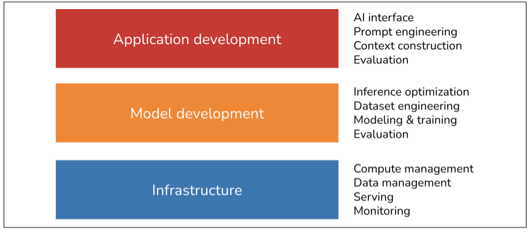

# July 3, 2025 - Month Plan setup

## 🎯 Daily Goals

- [x] Create the montly goal
- [x] First Chapter of AI Engineering Book

## 📝 What I Learned

### Overview of *AI Engineering* Chapter 1

The first chatper focuses on two aspects: why AI engineering is emerging as a new practice and what are the common practice and processes of developing AI application.

### Emergence of AI Engineering:

After 2023, the development of AI related applications has significantly increased. There are two main driving factors, **one is that AI models has scaled up to meet the business needs**. **Secondly, large companies started their the model as service business.** People can now easily access these foundation models through API calls. (You have to pay for it though. The good news is that the price is getting lower and lower) 

#### Different Types of LLM models

There are two types of LLM models: **Masked language model** and **Autoregressive language model**. To explain in simple terms, **masked language model** predict missing token using the context form both before and after the missing token like "My favorite __ is blue". One of the use case is code debugging. For the most common AIGC application, we gonna choose **autoregressive language model** which only predicts token based on the previous tokens. After the generation it would takes the generated token into the context. That's where the autoregressive comes from.

#### Token
Token is the smallest unit of vocabulary inside a language model. It could be a word or a part of word like "ing". It stands for the smallest meaningful component of a word. People use token instead of word to train LLM for the following reasons

- Token stands for smallest meaningful component of a word which can lead to better accuracy during prediction
- Using token we can actually let model to understand more with limited vocabulary. e.g. to teach the model these words: "cook", "cooking", "learn" and "learning" would require 4 entries if we are using the whole word to encode it. However, if we break them down into token, it only requires three tokens "cook", "learn" and "ing"
- This would help model understand made up words like "chatgpting"

Actually, the concept LLM, is already obsolete. The input for models moves beyond text. Companies have already incorporated more data modalities like video and audios to make them more powerful. These models are better characterized as *foundation models*

!!! info "Self-supervised learning"

    Self-supervised learning is a type of machine learning where the model generates its own label from the raw data so we don't have to manually labeled the data. For LLM, it is obvious that, we can just remove some of the words from the sentence and let it to predict the missing word. It is self-supervised learning that makes the training of LLM economically possible.

### Layers of AI Stack

Here is a very good illustration of the three lay of current AI stack.

## 🚀 Concepts that Requires Further Study:

- Bert
- Transformer
- MoE
- Self-supervised Learning
- Embedding
- Goldman Sachs Research
- FactSet
- SEO
- ChatGPT Memory
- Calendly
- MailChimp
- Photoroom
- TTFT, TPOT, total latency
- [GPTs are GPTs: An Early Look at the Labor Market Impact Potential of Large Language Models](https://arxiv.org/abs/2303.10130)
- [CoT@32](https://storage.googleapis.com/deepmind-media/gemini/gemini_1_report.pdf)

