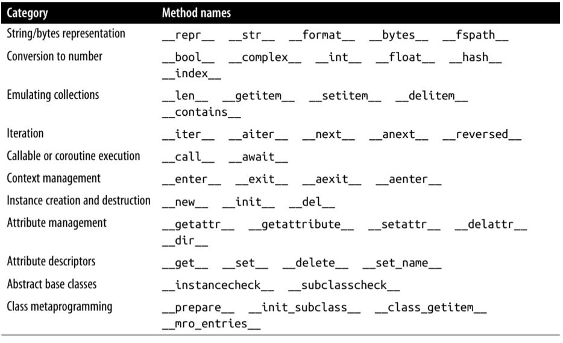
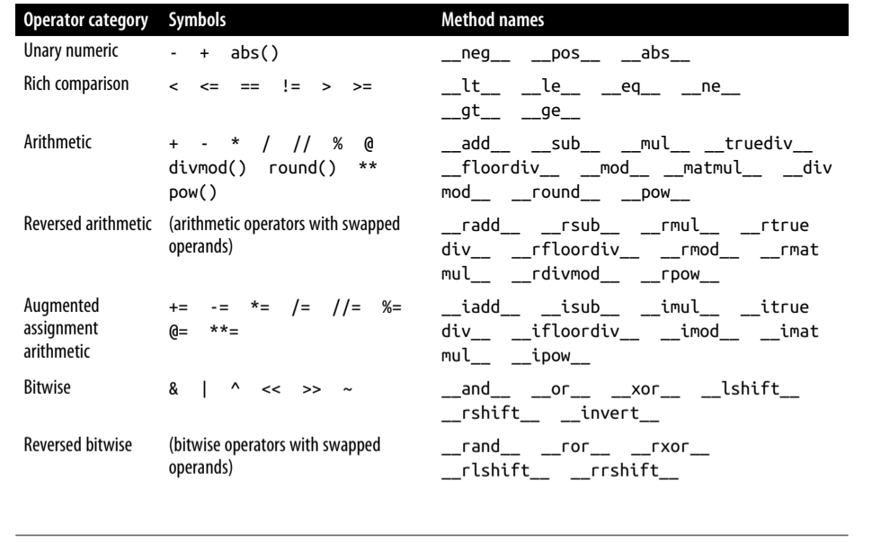
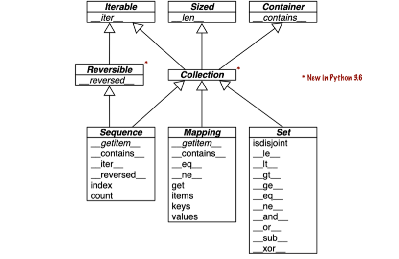
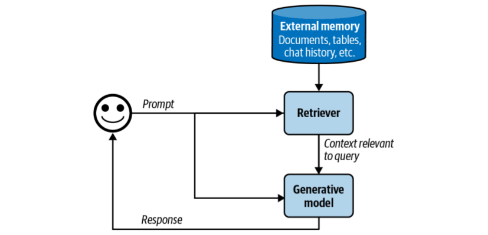
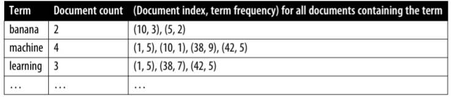
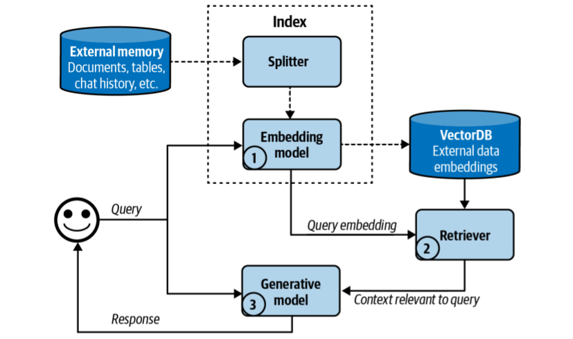
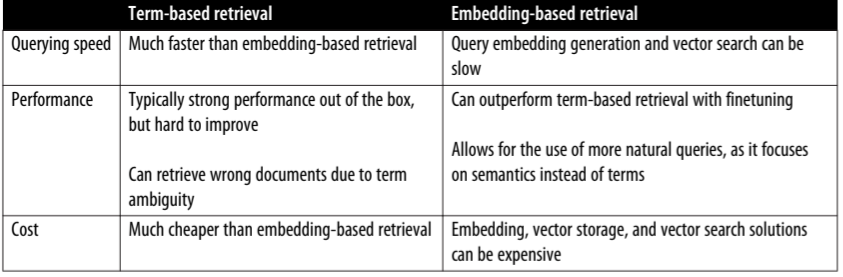

# July 6, 2025 - Daily Drill

## 🎯 Daily Goals

- [x] Review Anki Deck
- [x] Lumosity Training
- [x] RAG and Agents Chapter of AI Engineering
- [x] Chapter 1 of Fluent Python
- [x] Find interesting Github Repos


## 📝 What I Learned

### **Fluent Python**

#### Python Data Model

Python data model is a system of using special methods (commonly known as magic method) to make your custom class behave like Python built in class. This is how we make custom class Pythonic. 

#### Special Method

To enable idiomatic Python language features on our own class, special methods or magic methods are the way to go. They are usually in the format __*__. A good analogy of special method would be like defining api endpoint using fastapi. In fastapi, you can define some api endpoint like the following

```python
@app.get("/item/{id}")
def getitem(id: int, session: Session) -> Item:
    pass
```

After this, fastapi would know how to handle the http get request going to the root/item/{id}. While, we don't know what the fastapi's main event loop looks like, we know that after we define the function this would work. In terms of special method, the framework would be Python itself. After we define the dunder methods, we can enable some of the built in methods like `len(), in, int()`. Think of them as defining some API that allows the Python interpreter to know how to handle special operation with your class. Defining special method is exposing APIs to Python itself. 

#### Overview of Special Methods





#### Collection API

Here are some of the essential collection type in the language. All these classes are abstract base class which might indeed sound a bit abstract at first. 



!!! info "abc"
    What are abcs essentially. You must have heard these pharses before "a list like object, a map like object etc." A formal definition of "a list like object" is the abstract `Sequence` class in the abc module. Think of them as an interface which requires you to define certain set of methods to be qualified as certain class. For example, for some class to be considered as a `Sequence` abc, you must define `__getitem__`, and `__len__`. After you have defined these methods, the Python interpreter would implicitly consider your class as a `Sequence`. Then you can do the some of the built-in methods that takes `Sequence` as a valid input. e.g. `max(), sum(), sorted()`.

!!! note
    These arrows in the diagram means the source class is a subclass of the pointed ones. So a `Collection` would be an `Size`, `Iterable`, `Container`. And `Sequence`, `Mapping` and `Set` are the most common collection types.

### **RAG and Agent**

#### Why RAG and Agent?

Hallucination is one of the biggest obstacles of LLMs. It refers to the problem where LLMs would generate seemingly persuasive and yet factually inconsistent answers. The three main factors that would affect the LLM query qualities are:

- The instruction given to the model
- The context where the model is using to respond
- The model itself

RAG and agent are attempts to improve response qualities by providing better query context. 

#### RAG

RAG is a technique that enhances a model's generation by retrieving the relavant information from external memory sources. You can think of RAG as a technique to construct context for each query instead using the same one for all the queries. 

!!! note "context vs RAG"
    There have been on going discussion about if RAG would still be effective after the continuous improvement on the model context length. The author of the book gives two reasons why RAG would coexist with the long context length. First of all, the context length will never be enough. Since the amount of available data would usually grow rather than decrease over time. There would always be requirements on bigger and larger context length. Secondly, a model that can process long context does not necessarily mean that it can process it well. This is one of the famous problem of LLM called ["lost in the middle"](https://arxiv.org/abs/2307.03172). 

#### RAG architecture

Here is an overall RAG architecture.



As we can see that besides from the usual user and model interaction there is are extra component retriever and external memory get involved. According to the book retriever has two main functionality **indexing** and **querying**. 

!!! note
    Well, after some research it seems the indexing job is usually done in the background. Especially for the initial setup phase, the vector datastore would usually takes care of that. Some framework like Haystack would wrap the encoding model and the query engine together into the retriever class. Thus you can call something like `retriever.index(doc)`. Usually, the indexing job is not handled by the retriever.

Indexing refers to storing the documents or chunk into the vector DB and querying means embedding the user query and search the database for top k matching chunks. Sometimes the documents are just too big to be stored as one entry so the common practice is to split them into smaller chunks and then embed them and index them into the vector database.

!!! note "embedding vs indexing"
    Embedding is the process of using an AI embedding models like Word2Vec, and GloVe to convert text into numerical vectors. After the conversion words with similar semantic meaning would be closer to each other in the vector space. Indexing means putting the embedded chunks into the vector database. Each of them would use different indexing techniques for faster queries.

#### Two types of retrieval algorithms

**Term-Based Retrieval** is comparatively a straightforward way to find relevant documents. It determines the relevance of a document based on the frequency a term appears in that documents. In this case, we would check for the term frequency (TF) of all terms exists in the query. This is not enough since some of the terms are more important than other terms. For example, `transformer architecture` would be way much more important than `for example` when it comes to searching for relevance. One easy and yet effective way is to find the inverse document frequency (IDF) of each term. IDF = # of all documents / # of documents that contains the term. This means the more common a term exists in all documents the less important it is. Naively, we can just find the relevance score of the document by suming all terms' TF * IDF. Iterating through all documents takes `O(n)` time. We would use inverse index instead. 

!!! info "inverse index"
    Inverse index maps each term to all of the documents that has it. It would be something like this:
    

**Embedding-Based Retrievel** relies more on semantic level than lexical level. It embedds each document or chunk into numerical vector that can represent its semantic meaning. For searching, we basically embed the searching query with the same embedding model and then find its neighbors. 



#### Comparison of these two types:




## 🚀 Resources that Requires Further Study:
- ["lost in the middle"](https://arxiv.org/abs/2307.03172). 

## 🏭 Interesting Github Repo:

- [Folo: An all in one media app](https://github.com/RSSNext/Folo)
- [MediaCrawler](https://github.com/NanmiCoder/MediaCrawler)
